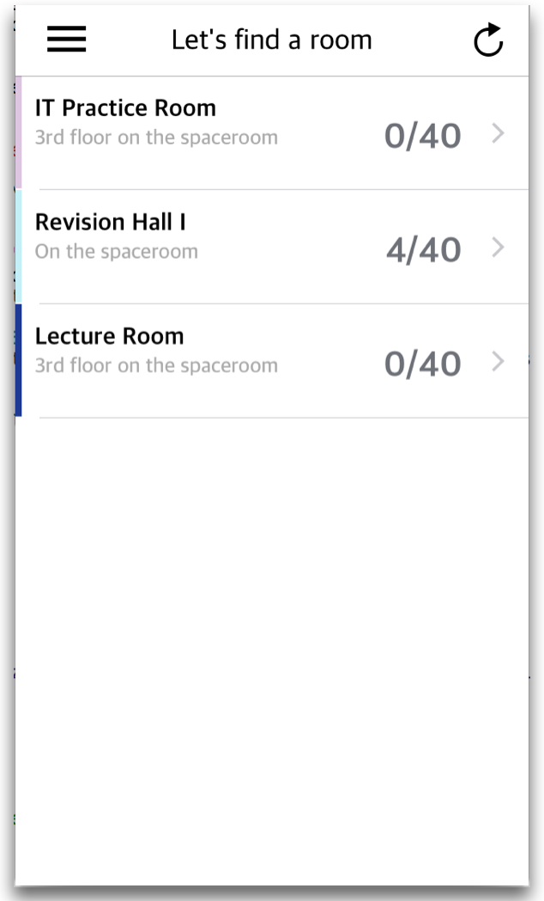
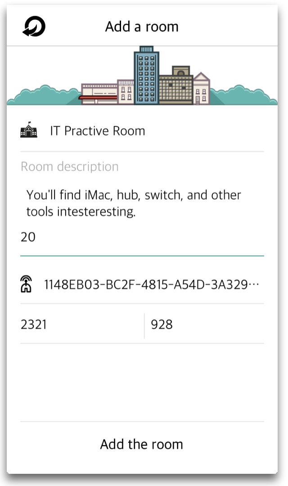
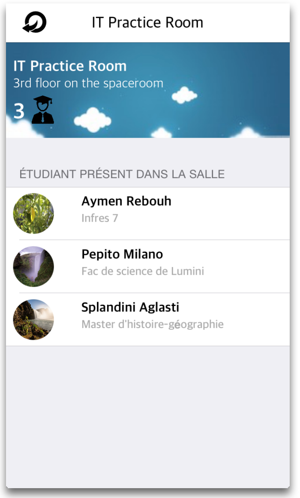

Aymen Rebouh - WWDC 2015
========

Student project realizing an iOS app and using beacons technologies, organized by Infotel, a french company where the goal was to **revolutionize the student life**.

A few months ago, my classmate and I where in teams (groups of 4-5 students) for a two years real project. So we were in a school, maybe of 300-400 students for a little university. Most of the time we needed a revision room to work together. But it was a little difficult. Sometimes the room was full, sometimes it was closed. 

For this project, I remembered that. Beeing able to find easely a room to work, to study. Beeing able to know if your teammate are in a particular room and join them. Beeing able to find a room that suits you ( depending of the number of students presents for example ). An iOS project that interact with **beacons**. That was my challenge ! 

## Requirement

- iPhone 5+ with Bluetooth LE 4.0
- Geolocalisation service activated
- Bluetooth activated
- A beacon with its identifiers ( UUID, Major, Minor values )

## Installation / Demo

- No externes dependencies ( like cocoapods or something )
- All you need to do in to open the .xcodeproj and run the project
- Don't forget to active geolocalisation
- You can create an account using the **School ID : aaaaaa**
- Hope you have beacons to enjoy it :]

## Issues

- UI not adapted for iPhone 4S ( need some works with scrollview )
- The project is big, that's because I'm importing Facebook/Google framework sources

## Credits

- The author of the app : Aymen Rebouh [@aymenworks](http://twitter.com/aymenworks)
- The icons thumbnails : <http://www.flaticon.com/most-downloaded/>
- Network/JSON librairies : <https://github.com/Alamofire/Alamofire> and <https://github.com/SwiftyJSON/SwiftyJSON>
- Popups : <https://github.com/stakes/JSSAlertView>
- Navigation Menu animation : <https://github.com/Yalantis/Persei>
- Activity Indicator animation : <https://github.com/icanzilb/SwiftSpinner>
    
##Contact
- Twitter [@aymenworks](http://twitter.com/aymenworks)
- Email : <aymenmse@gmail.com>
- Linkedin : <http://fr.linkedin.com/in/rebouhaymen/fr>
- Number : +33623185407

